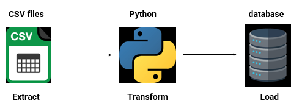
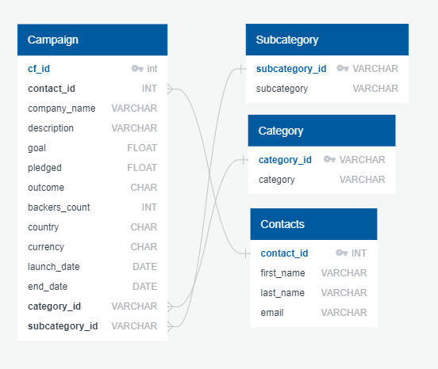

# Crowdfunding_ETL
Project 2
Contributors
Yi Wen
Jaskirat Singh

Background

Extract, transform, and load (ETL) is the process of combining data from multiple sources into a data warehouse. 

In this ETL mini project, an ETL pipeline was built using Python, Pandas, and either Python dictionary methods to extract and transform the data from excel files. After the data was transformed, four CSV files were created. Based on the generated CSV data, an ERD and a table schema were established. The CSV file data was imported into corresponding tables in a Postgres database.

 

List of Content

1. A folder of Resouces containing excel and csv files

2. A Jupyter Notebook named ETL_Mini_Project_YWen_J.Singh

3. Three SQL files: crowdfunding_db_schema_J_Singh

4. Images of ERD and diagram of ETL

Instructions

The instructions for this mini project are divided into the following subsections:

Create the Category and Subcategory DataFrames

Create the Campaign DataFrame

Create the Contacts DataFrame

Create the Crowdfunding Database

Create the Category and Subcategory DataFrames

>>Extract and transform the crowdfunding.xlsx Excel data to create a category DataFrame that has the following columns:

A "category_id" column that has entries going sequentially from "cat1" to "catn", where n is the number of unique categories

A "category" column that contains only the category titles

The following image shows this category DataFrame:

category DataFrame

Extract and transform the crowdfunding.xlsx Excel data to create a subcategory DataFrame that has the following columns:

A "subcategory_id" column that has entries going sequentially from "subcat1" to "subcatn", where n is the number of unique subcategories

A "subcategory" column that contains only the subcategory titles

The following image shows this subcategory DataFrame:

subcategory DataFrame

>>Create the Campaign DataFrame
Extract and transform the crowdfunding.xlsx Excel data to create a campaign DataFrame has the following columns:

The "cf_id" column

The "contact_id" column

The "company_name" column

The "blurb" column, renamed to "description"

The "goal" column, converted to the float data type

The "pledged" column, converted to the float data type

The "outcome" column

The "backers_count" column

The "country" column

The "currency" column

The "launched_at" column, renamed to "launch_date" and with the UTC times converted to the datetime format

The "deadline" column, renamed to "end_date" and with the UTC times converted to the datetime format

The "category_id" column, with unique identification numbers matching those in the "category_id" column of the category DataFrame

The "subcategory_id" column, with the unique identification numbers matching those in the "subcategory_id" column of the subcategory DataFrame

The following image shows this campaign DataFrame:

campaign DataFrame

Create the Contacts DataFrame

Extracting and transforming the data from the contacts.xlsx Excel data

Create the Crowdfunding Database

Inspect the four CSV files, and then sketch an ERD of the tables by using QuickDBDLinks to an external site..

Use the information from the ERD to create a table schema for each CSV file.

Save the database schema as a Postgres file named crowdfunding_db_schema.sql

Create a new Postgres database, named crowdfunding_db.

Using the database schema, create the tables in the correct order to handle the foreign keys.

Verify the table creation by running a SELECT statement for each table.

Import each CSV file into its corresponding SQL table.

Verify that each table has the correct data by running a SELECT statement for each.
